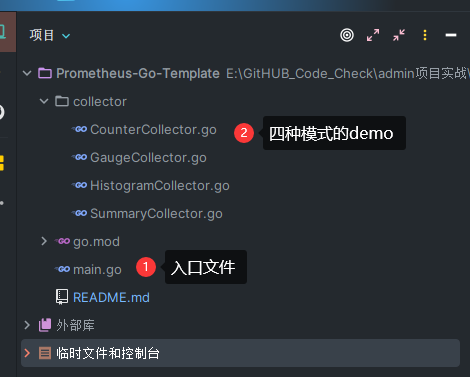

# Go开发Prometheus客户端实战步骤

Go开发Prometheus的客户端模版，包含四种模式（Counter，Gauge，Summary，Histogram）

## 四种模式

Prometheus的指标有四种类型，分别是Counter，Gauge，Histogram，Summary。

- Counter
  只增不减的计数器，用于描述某个指标的累计状态，比如请求量统计，http_requests_total。重启进程后会被重置。

- Gauge
  可增可减的计量器，用于描述某个指标当前的状态，比如系统内存余量，node_memory_MemFree_bytes。重启进程后会被重置。

- Histogram
  直方图（可以通俗的用柱状图来理解）指标用于描述指标的分布情况，比如对于请求响应时间，总共10w个请求，小于10ms的有5w个，9小于50ms的有9w个，小于100ms的有9.9w个

- Summary
  和直方图类似，summary也是用于描述指标分布情况，不过表现形式不同（它提供一个quantiles的功能，可以按%比划分跟踪的结果）。比如还是对于请求响应时间，summary描述则是，总共10w个请求，50%小于10ms，90%小于50ms，99%小于100ms。

  

  Summary相比Histogram的使用场景会比较多一些，因为对服务端资源需求更少，但是在查询时histogram的资源消耗会比summary相对于更多。其实也就是summary把资源消耗转移到了服务端，指标的分布数据是计算好再导出的。

## 目录结构



## 使用方式

```go
git clone https://github.com/nangongchengfeng/Prometheus-Go-Template.git
cd Prometheus-Go-Template
go mod tidy

go run main.go
```

**测试接口**

```
http://localhost:8080/api
http://localhost:8080/query
```

1. **启动HTTP服务**：启动服务并监听8080端口。
2. **访问指标数据**：通过浏览器访问`http://localhost:8080/metrics`查看指标数据。

##   原理

- 监控器初始化：
  默认情况下，当引入 registry 包时，会触发对 gocollect 这个采集器的初始化，这是因为 registry 在初始化时会调用 describe 接口，而 gocollect 正是实现了这个接口。

- 数据采集流程：
  当有 HTTP 请求到达时，http.handle 会调用 registry 的 gather 函数。在 gather 函数内部，会调用具体采集器的 collect 接口，这个实现就是 gocollect 中的 collect 函数。这一流程确保了数据的采集和处理。

- 多类型处理：
  上述流程仅是一种特殊情况，实际上，对于四种不同类型的监控器（Counter、Gauge、Histogram 和 Summary），都有对应的结构体继承了基本函数接口，并实现了相应的接口。每种监控器都有自己独特的逻辑和实现方式，但整体流程大致相同。

- 自定义监控器：
  如果需要实现自定义的监控器逻辑，可以新建一个结构体作为监控器，实现 describe 和 collect 接口。这样，就可以根据自己的需求实现特定的监控逻辑。最终，这些自定义监控器的实现原理也是调用了四种不同类型监控器的相关函数，以实现数据的采集和处理。

  

